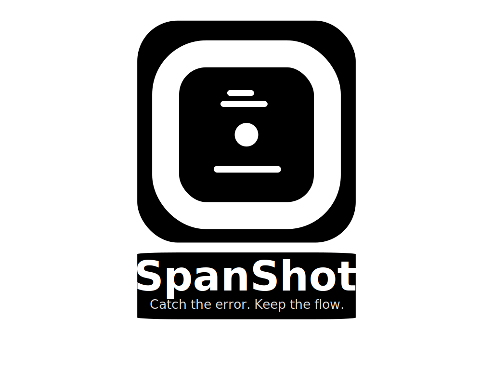

<div align="center">
  
</div>

# SpanShot

[](https://github.com/albertodvp/spanshot/actions/workflows/ci.yml)
[](https://codecov.io/gh/albertodvp/spanshot)

[](LICENSE)

> Catch the error. Keep the flow.

**Cross-platform testing:** Ubuntu, macOS, and Windows with GHC 9.12

## The Problem

Developers waste **10-30 minutes per error** manually:

- Hunting through scattered logs
- Copy-pasting to ChatGPT
- Gathering code context (files, git history, stack traces)
- Reasoning about root causes

With **5-8 errors per day**, this compounds into **hours of lost productivity**.

## The Solution

SpanShot is a **local CLI daemon** that automatically:

1. **Watches** your logs
1. **Detects** errors with temporal context (the "span window" of what happened before/after)
1. **Diagnoses** root causes using AI with full code context
1. **Delivers** actionable fixes through notifications

All **without leaving your terminal**.

## The Impact

**Reduces error diagnosis time from 10-30 minutes to under 1 minute** by automating context gathering and AI analysis, while keeping you in flow state.

- No cloud backend
- No signup
- BYOK (bring your own API key)
- Open source
- Privacy-first (local-first, optional local AI)

## Pipeline Vision

```
┌──────────────┐    ┌──────────────┐    ┌──────────────┐    ┌──────────────┐
│   COLLECT    │───▶│   CAPTURE    │───▶│   ANALYZE    │───▶│   DELIVER    │
└──────────────┘    └──────────────┘    └──────────────┘    └──────────────┘
  Gather logs        Detect errors       AI reasoning        Get fixes
  Unify sources      Span window         Root cause          Notifications
```

| Phase | Purpose | Input | Output | AI Used? |
|-------|---------|-------|--------|----------|
| **Collect** | Unify scattered error sources into one stream | Raw logs, stdout, Docker | Normalized event stream | No |
| **Capture** | Identify errors + capture temporal context (span) | Event stream | Error event + span window | No |
| **Analyze** | Understand *why* error happened + *how* to fix | Error + span + code context | Diagnosis + solution | Yes |
| **Deliver** | Present insights without disrupting workflow | Diagnosis | Notification/alert | No |

**Key Insight:** Capture doesn't just find the error line—it captures a **time-window snapshot** (e.g., 5 seconds before/after) to give AI the full story of what led to the failure.

**Current Status:** Building **Collect + Capture** (v0.1) - AI-free monitoring with deterministic pattern matching.

## Installation

**Prerequisites:** Nix with flakes (recommended for consistent dev environment with pre-configured tooling) or GHC 9.12.2+ and Cabal 3.10+

```bash
# Enter development environment (Nix)
nix develop

# Build
just build

# Run tests
just test

```

## Quick Start

### Current (v0.1 - Collection Only)

```bash
# Tail a log file and stream as JSONL
spanshot collect --logfile /var/log/app.log

# Filter errors with jq
spanshot collect --logfile app.log | jq 'select(.line | contains("ERROR"))'
```

### Capture (v0.1)

```bash
# Capture errors with temporal context (uses detection rules from config)
spanshot capture --logfile app.log

# Run full pipeline (collect + capture)
spanshot run --logfile app.log
```

> **Note:** The `capture` and `run` commands tail the log file continuously (like `tail -f`). Detection rules and window settings are read from your `.spanshot.yaml` config file. See [Configuration](#configuration).

## Configuration

SpanShot uses hierarchical configuration with project-level overrides:

1. **User config**: `~/.config/spanshot/config.yaml`
1. **Project config**: `.spanshot.yaml` (in git project root)

Project config overrides user config field-by-field. If no config is found, sensible defaults are used.

### Config Commands

```bash
# Show merged configuration (defaults + user + project overrides)
spanshot config show

# Show config file paths and status
spanshot config path

# Initialize a config file (optional - defaults work out of the box)
spanshot config init              # creates .spanshot.yaml at project root
spanshot config init --user       # creates user config
spanshot config init --force      # overwrite existing
```

### Example Config

```yaml
capture:
  pre_window_duration: 5    # seconds before error
  post_window_duration: 5   # seconds after error
  min_context_events: 10
  detection_rules:
    - regex_pattern: "ERROR"
    - regex_pattern: "FATAL"
```

## Output Format

### Collection Events (Current)

Each line is a JSON event:

```json
{"source":"./app.log","session_order_id":0,"read_at_utc":"2025-10-15T16:32:05.123456Z","line":"[INFO] Application started"}
```

**Fields:**

- `source`: Log file path
- `session_order_id`: Sequential counter (resets per run)
- `read_at_utc`: UTC timestamp when event was read
- `line`: Raw line content (no trailing newline)

### Span Snapshots (Coming Soon)

```json
{
  "error_event": {
    "source": "./app.log",
    "session_order_id": 42,
    "read_at_utc": "2025-10-15T16:32:15.123Z",
    "line": "ERROR: Database connection failed"
  },
  "pre_window": [
    {
      "source": "./app.log",
      "session_order_id": 40,
      "read_at_utc": "2025-10-15T16:32:10.000Z",
      "line": "INFO: Connecting to database..."
    },
    {
      "source": "./app.log",
      "session_order_id": 41,
      "read_at_utc": "2025-10-15T16:32:12.000Z",
      "line": "INFO: Retrying connection..."
    }
  ],
  "post_window": [
    {
      "source": "./app.log",
      "session_order_id": 43,
      "read_at_utc": "2025-10-15T16:32:16.000Z",
      "line": "WARN: Falling back to cache"
    },
    {
      "source": "./app.log",
      "session_order_id": 44,
      "read_at_utc": "2025-10-15T16:32:18.000Z",
      "line": "INFO: Request completed with degraded service"
    }
  ],
  "detected_by": [
    {"regex_pattern": "ERROR"}
  ],
  "captured_at_utc": "2025-10-15T16:32:20.456Z"
}
```

## Current Limitations (v0.1)

**Scope:**

- Single file only (no Docker logs, stdout, multiple sources yet)
- No log rotation handling
- Line-based parsing (multi-line stack traces split into separate events)
- No structured field extraction from JSON/logfmt logs
- In-memory state only (no persistence)

**Capture:**

- Regex patterns only (no keyword or log-level detectors yet)
- No hard limit on post-window event count (bounded by `postWindowDuration` only; in high-throughput scenarios, memory usage scales with log volume within that time window)
- **Timestamps use reception time**: Time-based windowing uses when the line was *read*, not timestamps embedded in log content. This works well for live monitoring but means batch processing of static files won't respect original event timing. See [#18](https://github.com/albertodvp/spanshot/issues/18) for planned timestamp parsing support.

**Not Yet Built:**

- Analyze phase (AI diagnosis)
- Deliver phase (notifications)

**Platform-Specific:**

- **Windows**: Concurrent file access limitation - When `spanshot` is reading a log file, other processes cannot append to it simultaneously due to Windows' strict file locking. This affects real-time log tailing scenarios where logs are actively being written. Future versions will implement proper file sharing using Win32 API. **Workaround**: Use log rotation or batch processing instead of real-time tailing on Windows.

## Development

```bash
# Run all tests
just test

# Run specific test suite
just test-unit
just test-integration-cli

# Generate coverage report
just test-coverage
just coverage-report

# Build
just build
```

See [`justfile`](justfile) for all available commands.

## Testing

The project includes two test suites:

1. **Unit tests** - Test core library functionality (streaming, event generation, error detection)
1. **CLI integration tests** - End-to-end validation of the compiled binary, including JSONL output format and error handling

Run with `just test` or `cabal test`.

## Architecture

SpanShot is designed as a modular pipeline with distinct phases:

- **Collect** (`src/Collect.hs`): Stream log files, normalize to JSONL events
- **Capture** (`src/Capture.hs`): Detect errors, capture temporal span windows *(in progress)*
- **Analyze**: AI-powered root cause diagnosis *(planned)*
- **Deliver**: Notification and alert delivery *(planned)*

**Current Implementation:**

- **Library** (`src/`): Collect (complete), Capture (in progress)
- **Executable** (`app/`): CLI with `collect` command (+ `capture`/`run` coming soon)
- **Tests** (`test/`): Unit tests and CLI integration tests with fixtures

**Key Principle:** Phases 1-2 (Collect + Capture) are **AI-free** and use deterministic pattern matching. Only Phase 3 (Analyze) uses AI.

## Contributing

This project follows the [Angular Commit Message Convention](https://github.com/angular/angular/blob/22b96b9/CONTRIBUTING.md#commit).

**Types:** `feat`, `fix`, `docs`, `style`, `refactor`, `perf`, `test`, `build`, `ci`, `chore`

**Format:** `<type>(<scope>): <subject>`

## Roadmap

### v0.1 - Collect + Capture (In Progress)

**Collect**

- [x] Stream log files with tail-f behavior
- [x] JSONL output with metadata (source, timestamp, line number)
- [x] UTF-8 decoding with lenient error handling
- [x] Unit tests + CLI integration tests

**Capture**

- [x] Core types (DetectionRule, SpanShot, CaptureOptions)
- [x] Regex-based error detection
- [x] Time-based window buffering (span window: pre/post context)
- [x] Stream combinator (`captureFromStream`)
- [x] CLI commands (`capture` and `run`)
- [x] CLI integration tests
- [ ] Inactivity timeout for pending captures
- [ ] Parse timestamps from log content ([#18](https://github.com/albertodvp/spanshot/issues/18))

### v0.2+ - Future Phases

**Configuration**

- [x] YAML configuration file support
- [x] Hierarchical config (user + project)
- [x] `config init` command

**Analyze** (spec in progress)

- AI-powered error diagnosis with temporal context
- Root cause reasoning using span window + code context
- Actionable solution generation
- BYOK support (OpenAI, Anthropic, local models)

**Deliver** (spec TBD)

- Terminal notifications
- Desktop alerts
- Integration hooks (webhooks, Slack, etc.)
