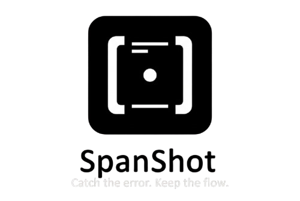

<div align="center">
  
</div>

# SpanShot

> Catch the error. Keep the flow.

A local, privacy-first log collection tool that tails log files and streams them as structured JSONL events.

## Overview

SpanShot continuously monitors log files and converts them into structured events with metadata (timestamps, source, line numbers). Perfect for feeding into analysis pipelines or monitoring systems.

**Current Status:** MVP v0.0 - Collection only. Future versions will add error detection, span capture, and AI-powered analysis.

## Installation

**Prerequisites:** Nix with flakes (recommended for consistent dev environment with pre-configured tooling) or GHC 9.12.2+ and Cabal 3.10+

```bash
# Enter development environment (Nix)
nix develop

# Build
just build

# Run tests
just test

# Install
cabal install
```

## Quick Start

```bash
# Tail a log file
spanshot collect --logfile /var/log/app.log

# Filter errors with jq
spanshot collect --logfile app.log | jq 'select(.line | contains("ERROR"))'
```

## Output Format

Each line is a JSON event:

```json
{"source":"./app.log","session_order_id":0,"read_at_utc":"2025-10-15T16:32:05.123456Z","line":"[INFO] Application started"}
```

**Fields:**
- `source`: Log file path
- `session_order_id`: Sequential counter (resets per run)
- `read_at_utc`: UTC timestamp when event was read
- `line`: Raw line content (no trailing newline)

## Features & Limitations

**Current:**
- ✅ Tail-f style continuous monitoring
- ✅ UTF-8 decoding with lenient error handling
- ✅ Streaming architecture (minimal memory)
- ✅ Clean shutdown on Ctrl-C

**Limitations (v0.0):**
- ❌ Single file only
- ❌ No log rotation handling
- ❌ Line-based parsing (multi-line stack traces split into separate events)
- ❌ No structured field extraction from JSON/logfmt logs
- ❌ In-memory state only (no persistence)

## Development

```bash
# Run all tests
just test

# Run specific test suite
just test-unit
just test-integration-cli

# Build
just build
```

See [`justfile`](justfile) for all available commands.

## Testing

The project includes two test suites:

1. **Unit tests** - Test core library functionality (streaming, event generation)
2. **CLI integration tests** - End-to-end validation of the compiled binary, including JSONL output format and error handling

Run with `just test` or `cabal test`.

## Architecture

- **Library** (`src/`): Core collection functionality - streams lines and produces normalized events
- **Executable** (`app/`): CLI wrapper that prints JSONL to stdout
- **Tests** (`test/`): Unit tests and CLI integration tests with fixtures

## Contributing

This project follows the [Angular Commit Message Convention](https://github.com/angular/angular/blob/22b96b9/CONTRIBUTING.md#commit).

**Types:** `feat`, `fix`, `docs`, `style`, `refactor`, `perf`, `test`, `build`, `ci`, `chore`

**Format:** `<type>(<scope>): <subject>`
